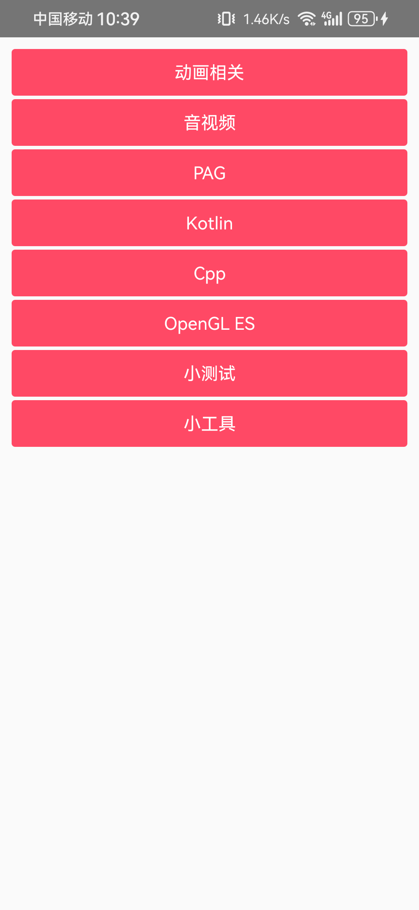
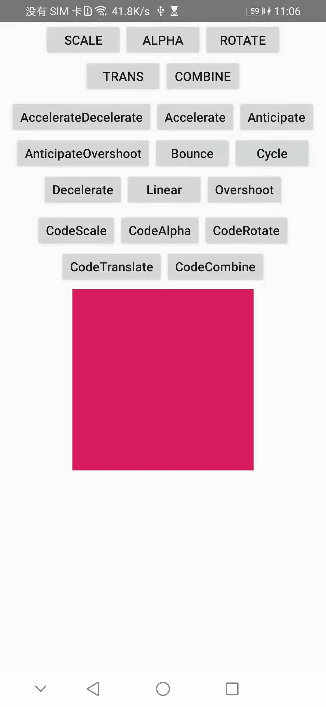
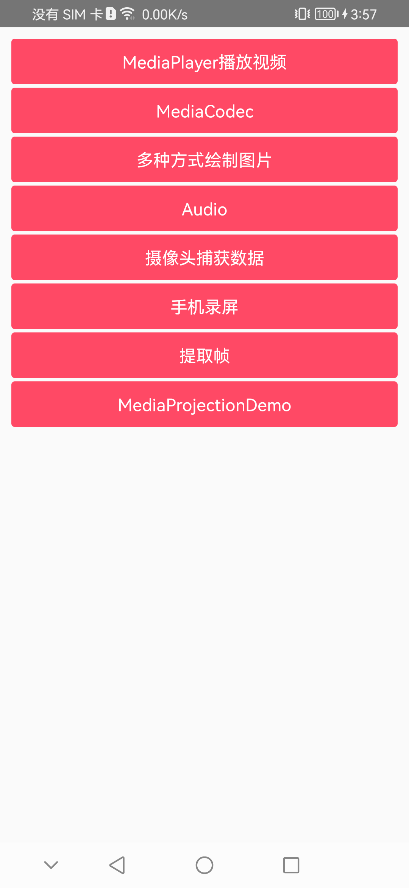
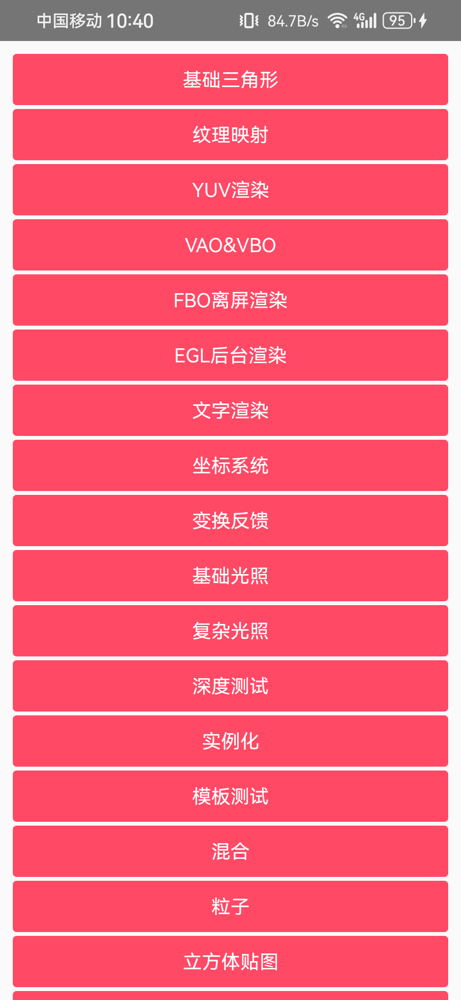
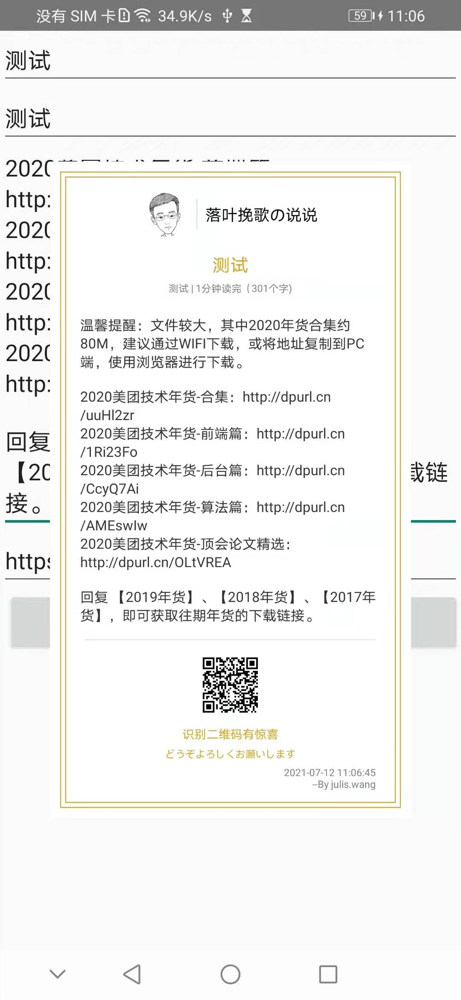

# JProject

自己的 Android 学习项目，包含诸多技术栈学习整理的代码合集

## 📋 项目概述

JProject 是一个多模块的 Android 学习项目，旨在通过实际代码示例展示现代 Android 开发的最佳实践和技术栈。项目采用模块化架构，每个模块专注于特定的技术领域。

## 🏗️ 项目结构

### 核心模块

- **app** - demo演示模块
- **jwbase** - 基础库模块，提供通用工具和基础组件
- **sourcecode** - 开源库代码学习模块
- **media** - 音视频处理模块
- **kotlinLearn** - Kotlin 语言特性和高级用法学习
- **learnopengl** - OpenGL ES 图形渲染学习
- **learnCpp** - C/C++ 与 Android NDK 学习

### 路由模块 (router)
- **annotation** - 路由注解定义
- **compiler** - 路由注解处理器
- **lib_router** - 路由库实现

## 🛠️ 技术栈

### 核心框架
- **Kotlin** - 主要开发语言
- **Coroutines** - 异步编程和并发处理
- **MVVM** - 架构模式
- **Lifecycle** - 生命周期管理

### 网络与数据
- **Retrofit2** - HTTP 客户端
- **OkHttp** - 网络拦截器和缓存
- **Gson** - JSON 序列化/反序列化
- **MMKV** - 高性能数据存储

### 依赖注入
- **Koin** - 轻量级依赖注入框架
- Scope 管理 - 作用域控制
- 参数注入 - 动态参数传递

### UI 与媒体
- **Glide** - 图片加载和缓存
- **Material Design** - 现代化 UI 设计
- **OpenGL ES** - 图形渲染
- **多媒体处理** - 音视频编解码

### 构建与工具
- **Gradle** - 项目构建系统
- **KAPT** - Kotlin 注解处理
- **MultiDex** - 多 dex 支持

## 📁 模块详细介绍

### sourcecode 模块
- **网络请求**：Retrofit2 + OkHttp 学习实现
- **依赖注入**：Koin 的各种使用场景
- **数据存储**：MMKV 高性能存储
- **图片加载**：Glide 集成使用

### media 模块
音视频处理相关功能：
- 音频播放和录制
- 视频编解码
- 多媒体格式处理

### kotlinLearn 模块
Kotlin 语言特性学习：
- 扩展函数和属性
- 协程和 Flow
- DSL 构建器
- 反射和元编程

### learnopengl 模块
图形渲染技术：
- OpenGL ES 基础
- 着色器编程
- 3D 图形渲染
- 纹理和光照

### learnCpp 模块
Native 开发：
- JNI 接口调用
- C++ 与 Java/Kotlin 交互
- NDK 开发实践

## 🚀 快速开始

### 环境要求
- Android Studio Arctic Fox 或更高版本
- JDK 8+
- Android SDK 28+

## 📸 示例

